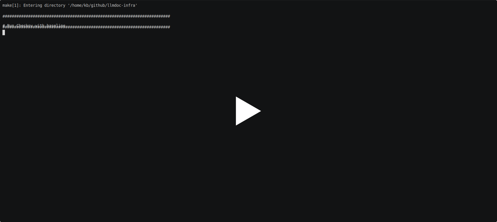
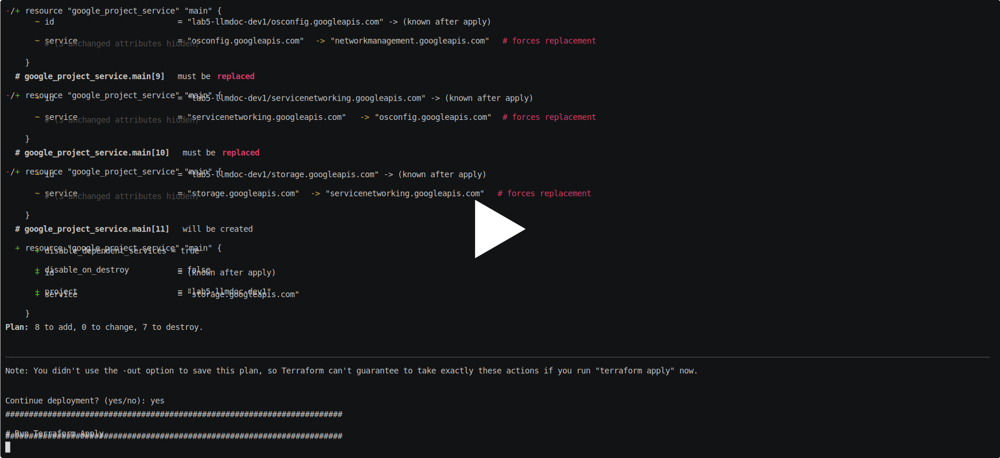
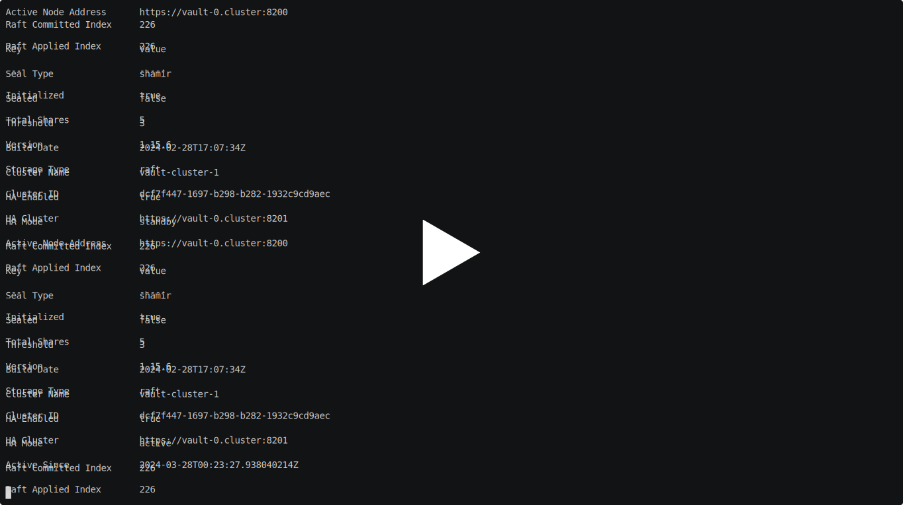

# Google Cloud Infrastructure for Document Question Answering with Generative AI and Elasticsearch

Google Cloud infrastructure deployment for https://github.com/kborovik/llmdoc

## Pipeline Design Principles

- Maximize short feedback development cycle by keeping all dependencies in the project
- Uncompromised end-to-end deployment and testing with a single command `make all`
- Manage deployment targets difference with configuration files `google_project.tfvars`
- Track code base changes with `git branch`
- Track code base deployment state with `git tag`

## Deployment Stack


## Security Static Analysis

Checkov is a static code analysis tool for scanning infrastructure as code (IaC) files for misconfigurations that may lead to security or compliance problems.

https://www.checkov.io/

```shell
make checkov
```

[](https://asciinema.org/a/643320)

## Terraform

Work in progress

```shell
make terraform
```

[](https://asciinema.org/a/642869)

## Kubernetes (HELM)

### HashiCorp Vault

```shell
make vault
```

[](https://asciinema.org/a/649438)

### Document Question Answering

Work in progress

## Functional Testing

Work in progress
