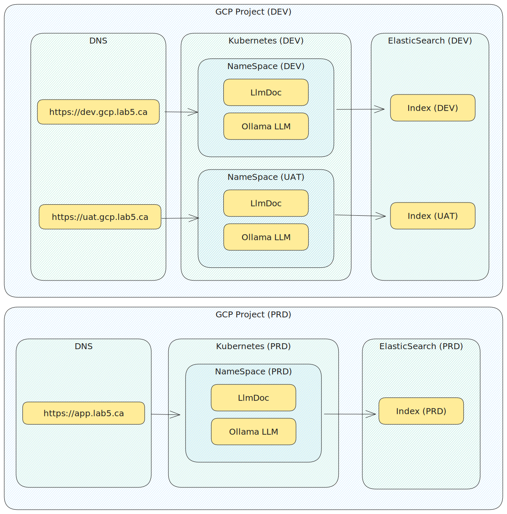

# Google Cloud Infrastructure for Document Question Answering with Generative AI and Elasticsearch

Google Cloud infrastructure deployment for https://github.com/kborovik/llmdoc

## Deployment Stack



# Pipeline Stages

- Security static analysis
- Terraform deployment
- Kubernetes deployment
- Functional testing

## Security Static Analysis

Checkov is a static code analysis tool for scanning infrastructure as code (IaC) files for misconfigurations that may lead to security or compliance problems.

https://www.checkov.io/

```shell
make checkov
```

[](https://asciinema.org/a/643320)

## Terraform

Work in progress

```shell
make terraform
```

[](https://asciinema.org/a/642869)

## Kubernetes (HELM)

### HashiCorp Vault

[](https://asciinema.org/a/649021)

### Document Question Answering

Work in progress

## Functional Testing

Work in progress
